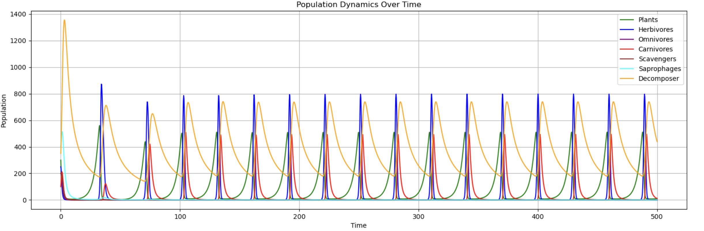
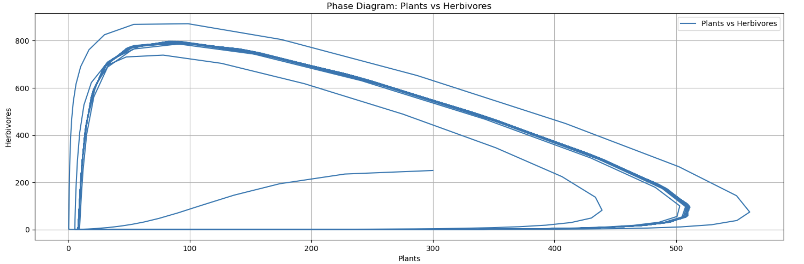
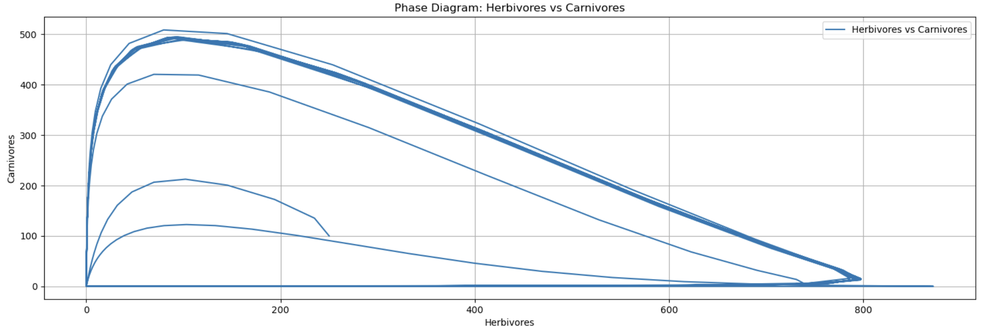

# Ecosystem Population Dynamics Simulation
### A 7-species food-web extension of the Lotka–Volterra predator–prey model

Modelling how 7 trophic groups — **Plants, Herbivores, Omnivores, Carnivores, Scavengers, Saprophages, and Decomposers** — interact over time, by extending the classical 2-species Lotka–Volterra equations into a coupled system of 7 ODEs.

> Group academic project at **Hochschule Rhein-Waal** (Rhine-Waal University of Applied Sciences), supervised by **Prof. Dr. Frank Zimmer**, January 2025. Coursework later credited at Fachhochschule Südwestfalen.

---

## The question

The original Lotka–Volterra model has only two species (predator and prey). Real ecosystems don't. We wanted to know:

- What happens to predator–prey oscillations once you add **5 more trophic levels** that all interact with each other?
- Do the classic closed-orbit phase diagrams survive, or break?
- Which species persist, and which don't?

## The model

Seven coupled ordinary differential equations, one per species. Each equation combines a **growth term** (food consumed), one or more **loss terms** (being eaten or decomposed), and an **intraspecific competition** term (`–x·N²`) that prevents unbounded growth. ~30 rate constants in total.

Solved numerically with `scipy.integrate.odeint` over `t ∈ [0, 500]`, starting from populations `[300, 250, 200, 100, 200, 400, 350]` (Plants → Decomposers).

The full equations and parameter table are in [`ecosystem.pdf`](./ecosystem.pdf).

---

## What the model actually does



**Three of the seven species go extinct almost immediately.** Omnivores, Scavengers and Saprophages fall to zero before `t = 15` and never recover. This is not a bug — it is what our chosen parameters produce. Each of those three sits in a "middle" trophic position: it is consumed by several species above it while competing for food with the species below it, and at the rate constants we picked, the losses outrun the growth from the start.

**The remaining four settle into a stable repeating cycle** with a period of roughly 30 time units. Plants, Herbivores, Carnivores and Decomposers keep oscillating for the full 500-step run with no sign of damping toward equilibrium.

### The surviving pairs still show classical Lotka–Volterra behaviour



The Plants↔Herbivores trajectory converges onto a single closed orbit rather than spiralling into a fixed point. The textbook two-species dynamic survives inside the larger system — for the pairs that survive.



Carnivores peak after Herbivores on every cycle. That lag is what makes the relationship a loop instead of a line: carnivore numbers keep climbing on a herbivore population that has already started to fall.

Decomposers behave the same way one level further out: they grow on the animal populations rather than on plants, so their cycle trails the herbivore boom instead of driving it. Their early spike to ~1,350 is the transient — they feed on the three species dying off in the first few time steps.

---

## What we got wrong the first time

An earlier version of this README described Omnivores, Scavengers and Saprophages as *"decoupling from the main rhythm"* and acting as *"buffers rather than amplifiers"*, and read the Decomposers↔Saprophages phase diagram as evidence of a *"slower nutrient-cycling regime layered underneath"*.

Both readings were wrong, and re-plotting the output is what exposed them. Those three species are not buffering anything — they are at zero. The Decomposers↔Saprophages plot is not a slow regime; it is a trajectory running into extinction, and the phase diagrams involving any of the three dead species carry no information about a relationship because one side of the relationship no longer exists.

The original figures hid this: on a linear axis, a population at zero is a flat line along the bottom that the eye reads as "not important" rather than "gone".

---

## Limitations (and what we'd do next)

- **No real ecological data fitted.** All ~30 rate constants are chosen by hand. The model demonstrates *qualitative* behaviour, not quantitative predictions for any specific ecosystem.
- **The parameters do not support coexistence.** Finding a parameter set where all seven species persist is the obvious next experiment, and would say more about food-web structure than the current run does.
- **No sensitivity analysis.** Varying each parameter ±20% would identify which relationships are load-bearing and which the system barely notices.
- **No stochasticity.** Real populations face random shocks. Adding noise terms would test whether the surviving four-species cycle is robust or knife-edge.

## Run it yourself

```bash
git clone https://github.com/Pritom-byte/ecosystem-population-dynamics-simulation.git
cd ecosystem-population-dynamics-simulation
pip install -r requirements.txt
jupyter notebook ecosystem.ipynb
```

Then open `ecosystem.ipynb` and run all cells.

## Files

| File | Contents |
|---|---|
| `ecosystem.ipynb` | The simulation — all parameters, equations, and the full set of plots. |
| `ecosystem.pdf` | Full 15-page write-up: introduction, derivation of all 7 equations, parameter table, results discussion, references. |
| `requirements.txt` | `numpy`, `scipy`, `matplotlib`. |
| `*.png` | The three figures above, re-plotted from the same model for readability. |

## Built with

`Python` · `NumPy` · `SciPy` (`odeint`) · `matplotlib` · `Jupyter`

## Authors

- **Pritom Mazumder** — [GitHub](https://github.com/Pritom-byte) · [LinkedIn](https://www.linkedin.com/in/pritxm/)
- **Dip Dutta**
- **Kaushik Shankar Roy**

Supervised by **Prof. Dr. Frank Zimmer**, Hochschule Rhein-Waal, January 2025.

## References

13 references in `ecosystem.pdf` — Lotka (1925), Volterra (1926), Wangersky (1978), Hsu/Ruan/Yang (2015), Wang & Zou (2020), and others on Lotka–Volterra extensions, food-web modelling, and decomposer–producer interactions.
